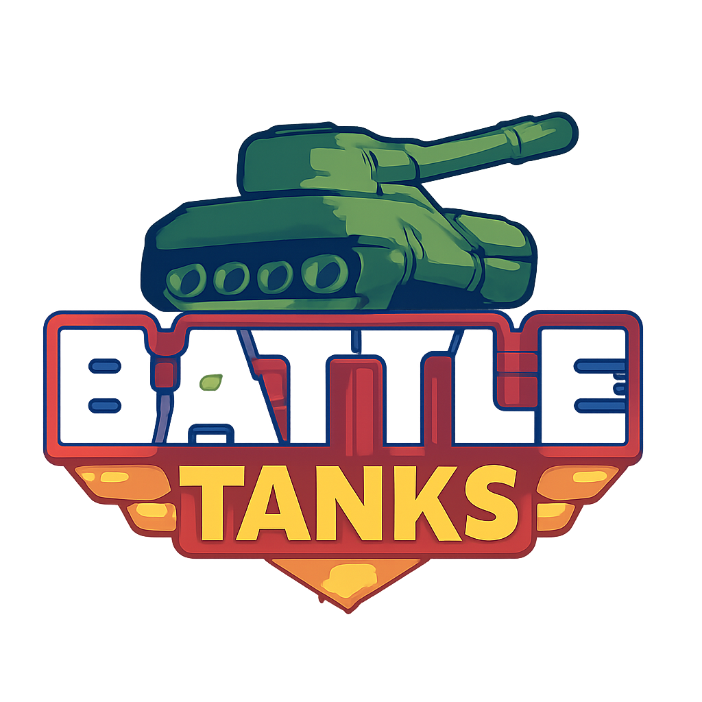
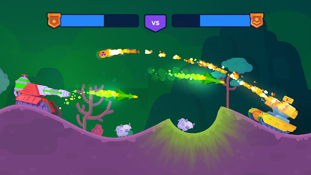

# 🚀 BattleTanks: A Multiplayer Tank Battle Game



<center></center>

Welcome to **BattleTanks**, a thrilling 2D multiplayer tank battle game developed using Java and the libGDX framework. Inspired by the classic Tank Stars game, this project showcases my skills in game development, object-oriented programming, and real-time multiplayer mechanics.

---

## 🎮 Game Overview

In **BattleTanks**, players engage in intense tank battles on destructible terrains. The objective is to outmaneuver and outgun your opponent using a variety of weapons and strategic tactics.

### Key Features:

* **Multiplayer Mode**: Challenge a friend in local multiplayer mode.
* **Destructible Terrain**: Alter the battlefield by destroying the environment.
* **Variety of Weapons**: Choose from a wide arsenal of weapons, each with unique effects.
* **Power-ups**: Collect power-ups to gain advantages during battles.
* **Smooth Controls**: Intuitive controls for an immersive gaming experience.

---

## 🛠️ Technologies Used

* **Java**: Core programming language.
* **libGDX**: Game development framework.
* **Gradle**: Build automation tool.
---

## 🚀 Installation Guide

To run **BattleTanks** locally:

1. **Clone the Repository**:

   ```bash
   git clone https://github.com/samridhgirdhar/Tank-War-game.git
   cd Tank-War-game
   ```

2. **Build the Project**:

   If you have Gradle installed:

   ```bash
   gradle build
   ```

   Alternatively, use the Gradle wrapper:

   ```bash
   ./gradlew build
   ```

3. **Run the Game**:

   After building, navigate to the appropriate directory and run the game using:

   ```bash
   java -jar TankStars.jar
   ```

---

## 🎮 How to Play

* **Player 1 Controls**:

  * Move: `W`, `A`, `S`, `D`
  * Shoot: `Spacebar`

* **Player 2 Controls**:

  * Move: Arrow Keys
  * Shoot: `Enter`

*Note: Customize controls in the settings menu.*

---

## 📸 Screenshots


<center></center>

---

## 🧪 Contributing

Contributions are welcome! To contribute:

1. Fork the repository.
2. Create a new branch (`git checkout -b feature-branch`).
3. Commit your changes (`git commit -am 'Add new feature'`).
4. Push to the branch (`git push origin feature-branch`).
5. Create a new Pull Request.

---

## 📄 License

This project is licensed under the MIT License - see the [LICENSE](LICENSE) file for details.

---

Feel free to explore, contribute, and enjoy the game! 🎮

---
